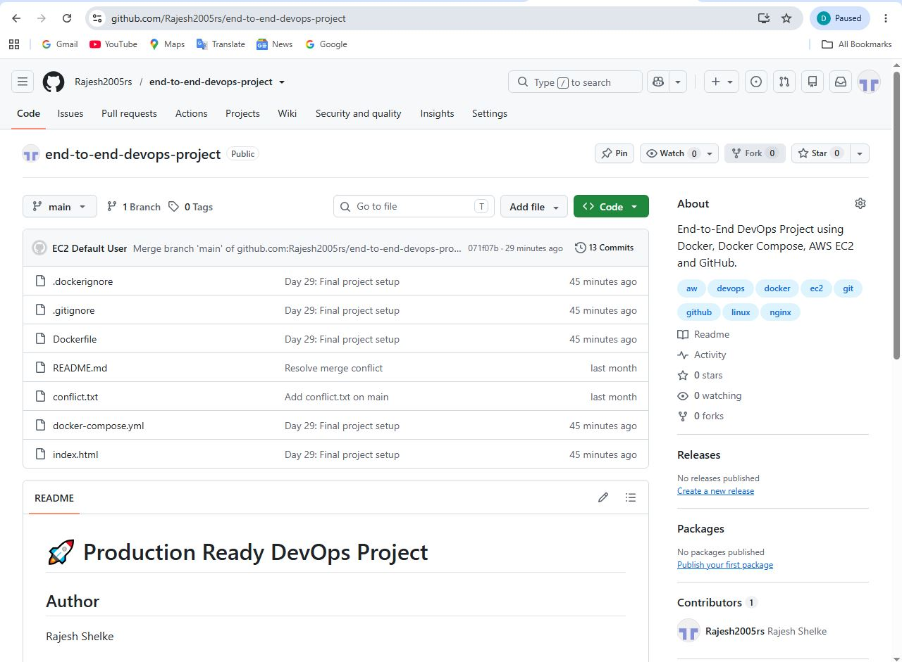
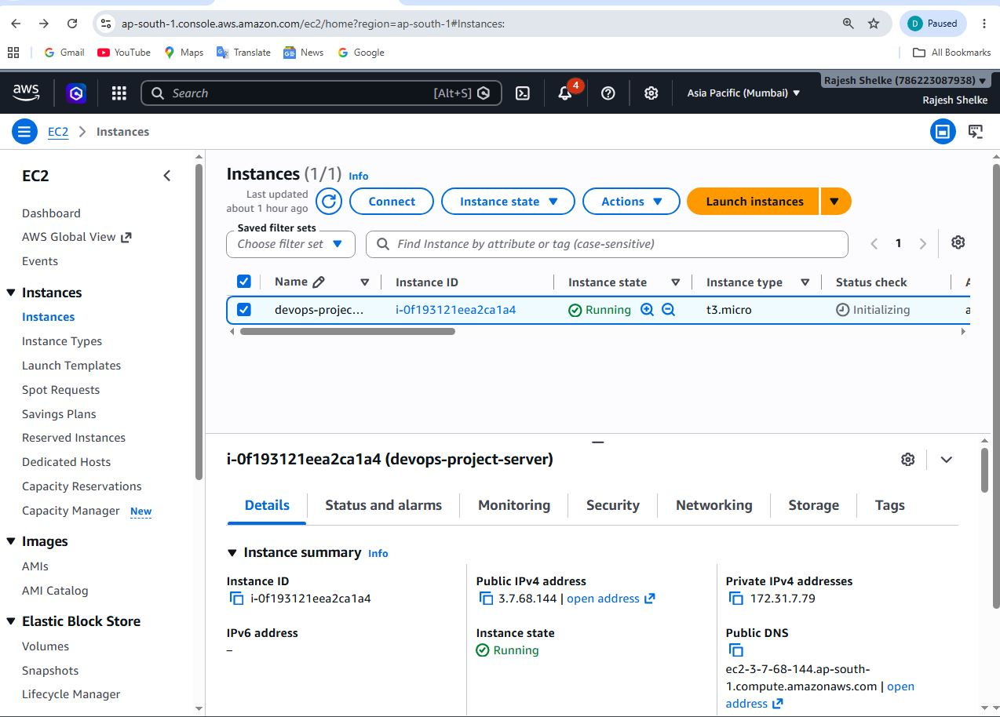
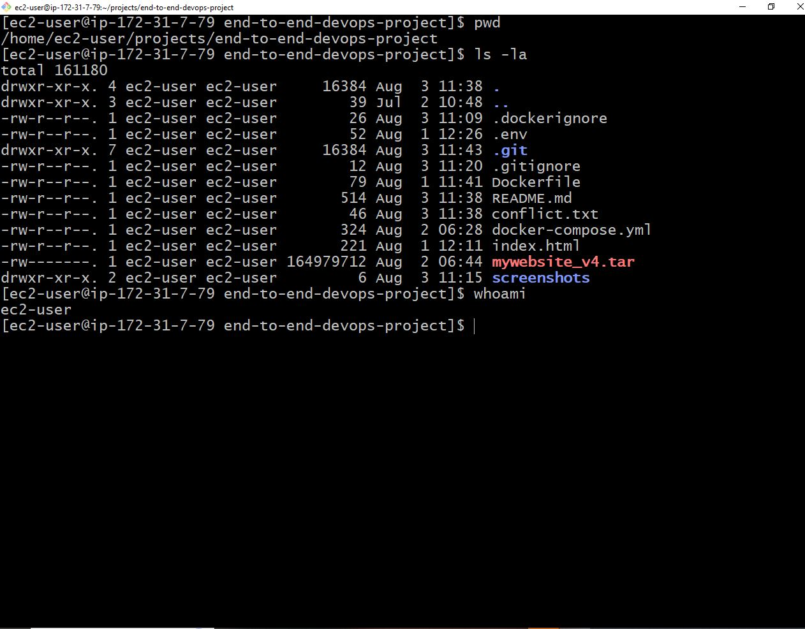
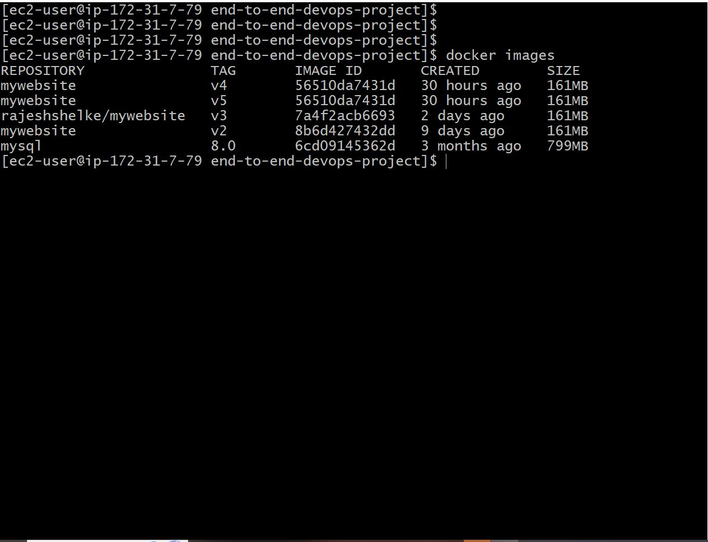
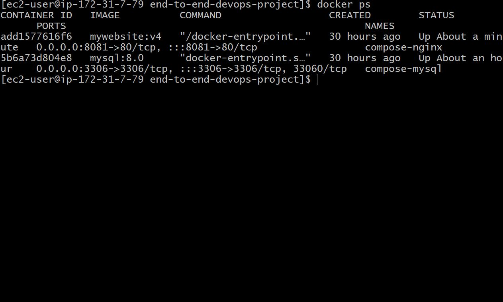
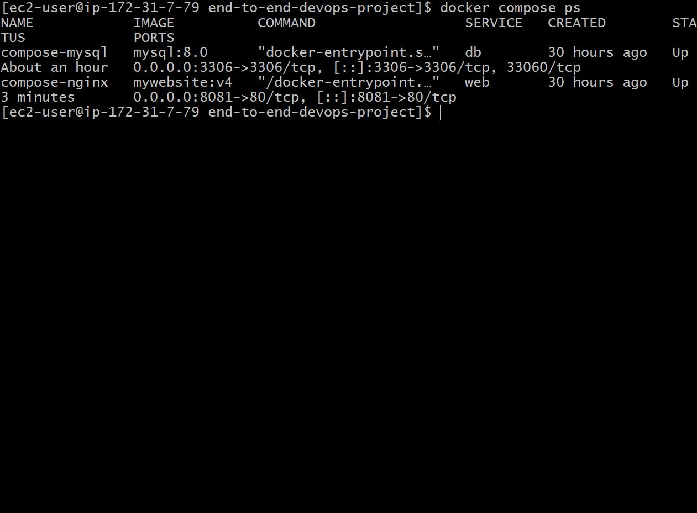
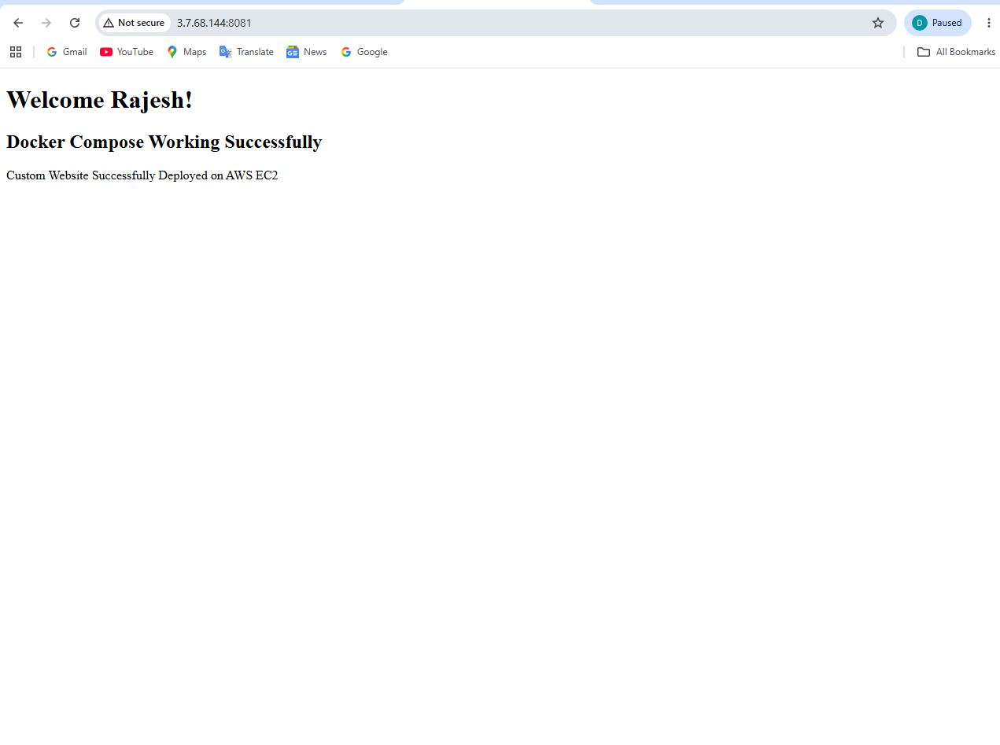
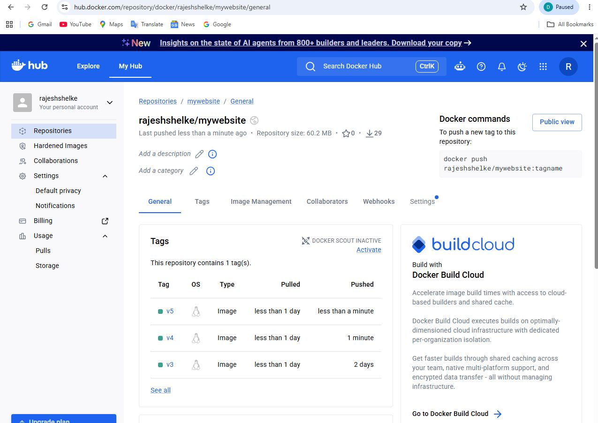
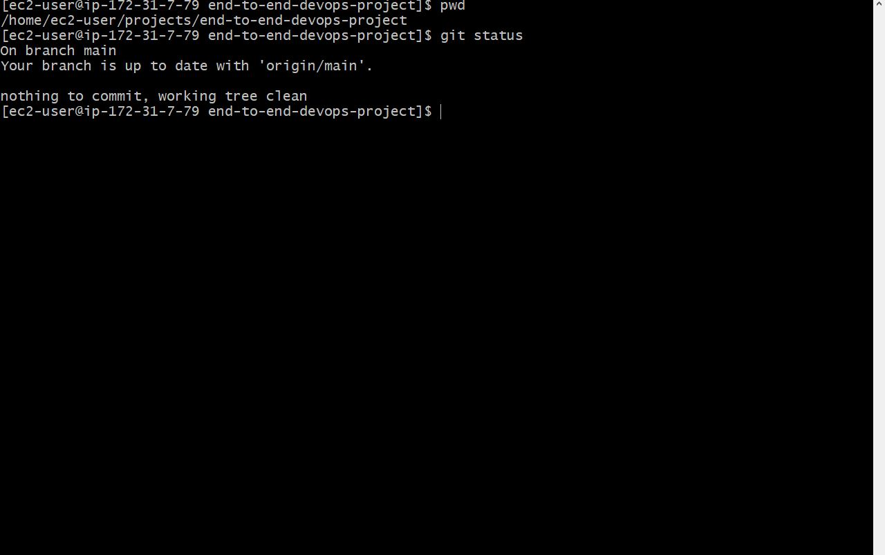
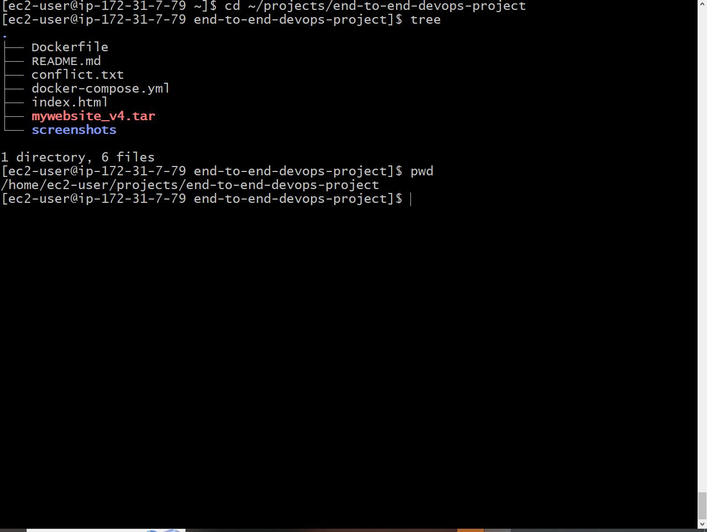

# End-to-End DevOps Project


---

# Project Overview

This project demonstrates an **End-to-End DevOps workflow** by deploying a web application using modern DevOps tools and practices.

The project focuses on implementing a real-world deployment lifecycle starting from source code management to cloud deployment.

The main objective is to gain practical experience with:

- Version Control using Git & GitHub
- Linux Server Administration
- AWS Cloud Deployment
- Nginx Web Server Configuration
- Docker Containerization
- Docker Compose Management

---

#  Features

- GitHub based source code management
- AWS EC2 cloud deployment
- Linux server configuration
- Nginx web server setup
- Docker container deployment
- Docker Compose service management
- Version controlled development workflow

---

# Tech Stack

| Technology | Purpose |
|------------|---------|
| Git | Version Control |
| GitHub | Source Code Repository |
| AWS EC2 | Cloud Infrastructure |
| Amazon Linux | Server Operating System |
| Nginx | Web Server |
| Docker | Containerization |
| Docker Compose | Container Management |
| HTML | Frontend Application |

---

#  Project Architecture

Developer
|
↓
Git & GitHub Repository
|
↓
AWS EC2 Instance
|
↓
Amazon Linux Server
|
↓
Nginx Web Server
|
↓
Docker Containers
|
↓
Live Application

---

# 📂 Folder Structure


end-to-end-devops-project
│
├── index.html
│
├── docker-compose.yml
│
├── README.md
│
├── screenshots
│
└── .gitignore


---

# ⚙️ Installation

## Step 1: Clone Repository

```bash
git clone https://github.com/Rajesh2005rs/end-to-end-devops-project.git

Move into project directory:

cd end-to-end-devops-project

🐳 Docker Commands

Check Docker version:

docker --version

Build Docker image:

docker build -t devops-project .

Run Docker container:

docker run -d -p 80:80 devops-project

Check running containers:

docker ps

Stop container:

docker stop container_id

🐳 Docker Compose

Docker Compose is used to manage application services.

Start services:

docker compose up -d

Check services:

docker compose ps

Stop services:

docker compose down

🐋Docker Hub

Docker images can be stored and managed using Docker Hub.

Docker workflow:

Dockerfile
      |
      ↓
Build Image
      |
      ↓
Tag Image
      |
      ↓
Push Image to Docker Hub

Commands:

docker login

docker tag image_name username/image_name

docker push username/image_name
☁️ AWS EC2 Deployment
EC2 Setup

Steps performed:

Created AWS EC2 Instance
Connected using SSH
Installed required packages
Configured Nginx Web Server
Deployed application

SSH Connection:

ssh -i key.pem ec2-user@public-ip
Nginx Installation

Install Nginx:

sudo yum install nginx -y

Start service:

sudo systemctl start nginx

Enable on boot:

sudo systemctl enable nginx

Application deployment location:

/usr/share/nginx/html

# 📸 Project Screenshots

## GitHub Repository



## AWS EC2 Instance



## EC2 Terminal



## Docker Images



## Docker Containers



## Docker Compose



## Website Running



## Docker Hub Repository



## Git Status




## Project Structure



## Project Structure


🚀 Future Improvements

Planned enhancements:

Implement CI/CD Pipeline using Jenkins or GitHub Actions
Infrastructure Automation using Terraform
Container Orchestration using Kubernetes
Monitoring using Prometheus and Grafana
Add Automated Testing
📚 Learnings

Through this project I learned:

✅ Linux Server Administration
✅ AWS EC2 Deployment
✅ Git & GitHub Workflow
✅ Nginx Configuration
✅ Docker Containerization
✅ Docker Compose
✅ DevOps Project Lifecycle

👨‍💻 Author

Rajesh Shelke

📄 License

This project is created for learning and portfolio purposes.

📞 Contact

<<<<<<< HEAD
GitHub: https://github.com/Rajesh2005rs
=======
GitHub: https://github.com/Rajesh2005rs

>>>>>>> 794e49e3fbd2bc5ca25a822ad10ca3250286e8bd
